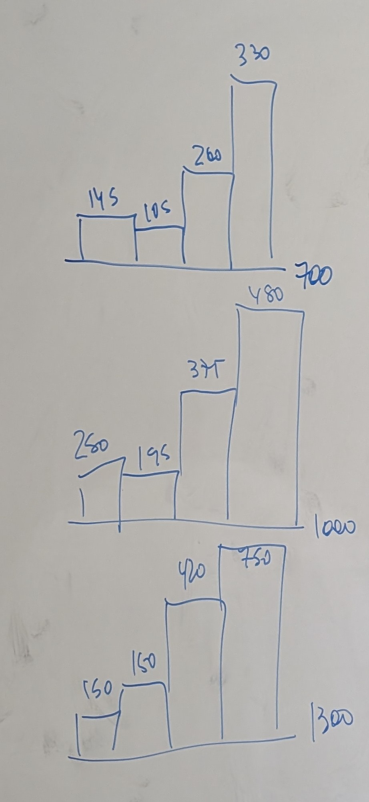

*Ejercicio 1.27* 
$y$ desgaste
$x$ carga
*c)* 

*d)* No hay linealidad. A mayor carga disminuye el desgaste que se le genera. Si se hace una regla de tres simples con la media de una carga para definir la de la siguiente no se acerca.